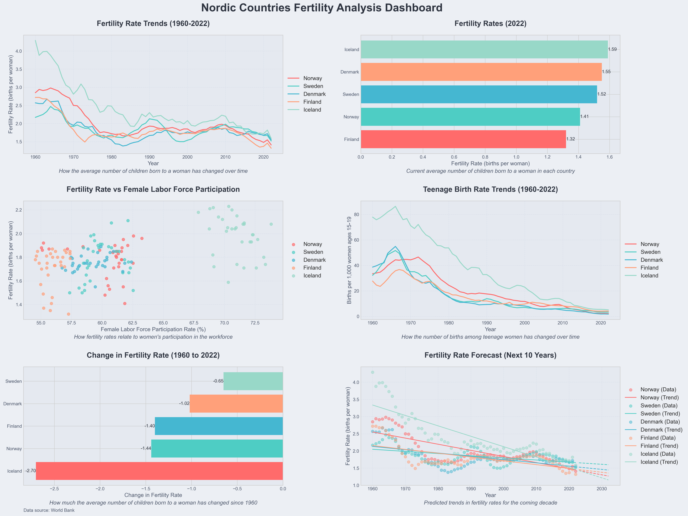

# Upgraded Nordic Fertility Dashboard

## Overview
This project creates a comprehensive data visualization dashboard analyzing fertility trends in Nordic countries using World Bank data. It demonstrates proficiency in data retrieval, processing, analysis, and visualization using Python.



## Features
- Fetches real-time data from the World Bank API
- Processes and analyzes demographic data
- Creates a multi-panel dashboard with six distinct visualizations
- Implements error handling and data validation
- Provides forecasting using simple linear regression

## Technologies Used
- Python 3.x
- pandas for data manipulation
- matplotlib and seaborn for data visualization
- scipy for statistical analysis
- requests for API interactions

## Visualizations
1. Fertility Rate Trends (1960-2022)
2. Latest Fertility Rates
3. Correlation between Fertility Rate and Female Labor Force Participation
4. Teenage Birth Rate Trends
5. Fertility Rate Change (1960 vs 2022)
6. Fertility Rate Forecast (Next 10 Years)

## Code Structure
- `get_country_codes()`: Fetches country codes from World Bank API
- `fetch_world_bank_data()`: Retrieves specified indicators for given countries
- `create_dashboard()`: Generates the multi-panel visualization dashboard

## Key Competencies Demonstrated
1. **API Integration**: Efficient use of the World Bank API with proper error handling
2. **Data Processing**: Cleaning and restructuring data with pandas
3. **Data Visualization**: Creating complex, multi-panel visualizations with matplotlib
4. **Statistical Analysis**: Implementing simple linear regression for forecasting
5. **Error Handling**: Robust error checking and fallback mechanisms
6. **Code Organization**: Modular design with separate functions for distinct tasks
7. **Data Analysis**: Deriving insights from raw data and presenting them visually

## Usage
1. Ensure required libraries are installed:
   ```
   pip install pandas matplotlib seaborn requests scipy numpy
   ```
2. Run the script:
   ```
   python nordic_fertility_dashboard.py
   ```
3. The dashboard will be saved as 'upgraded_nordic_fertility_dashboard.png'

## Customization
To analyze different countries or indicators:
1. Modify the `nordic_countries` list
2. Update the `indicators` list with desired World Bank indicator codes

## Future Improvements
- Implement more sophisticated forecasting models
- Add interactive elements using libraries like Plotly
- Create a web interface for user input and real-time visualization

This project showcases strong programming skills in data analysis, API integration, and data visualization, demonstrating the ability to create insightful and visually appealing dashboards from real-world data sources.
